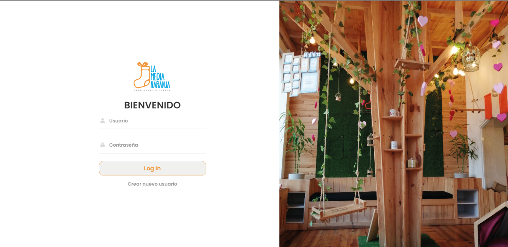
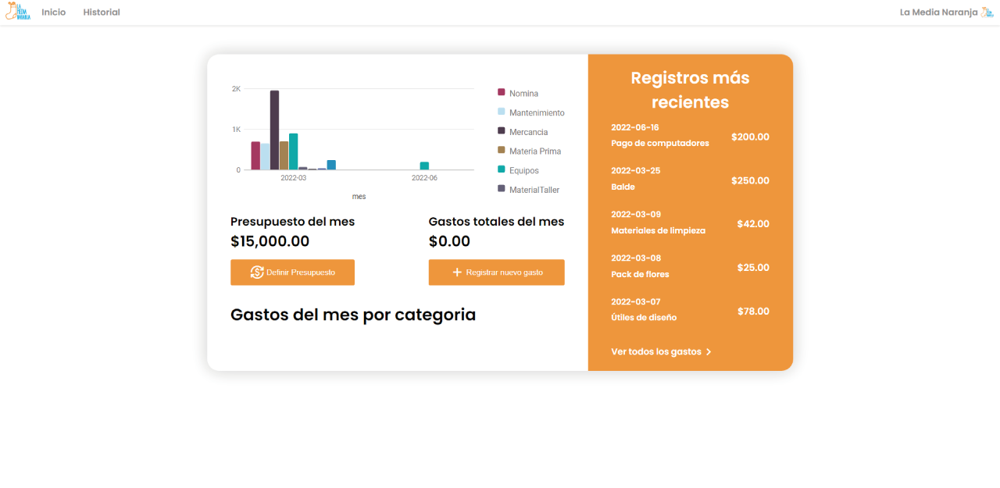
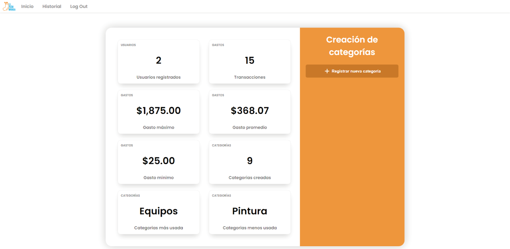
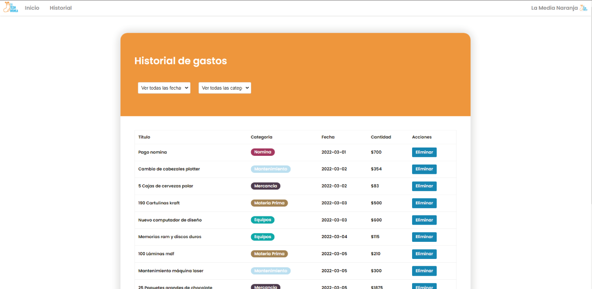

<div align="center">
  <a href="https://github.com/othneildrew/Best-README-Template">
    
  </a>

  <h3 align="center">Expenses app for "La Media Naranja"</h3>

  <p align="center">
    A basic management application to keep the company's accounting up to date.
  </p>
</div>

<!-- ABOUT THE PROJECT -->
## About The Project

<div align="center">
  
</div>

This application made in PHP and some styles and animations in CSS is the product of a university project where the company La Media Naranja located in Venezuela was used as an image.

Some of the app's features:

* Functional login and registration page with hash encryption
* Record of expenses and history with dates and days
* Administrator page: Category registration, overviews.

Of course, no one template will serve all projects since your needs may be different. So I'll be adding more in the near future. You may also suggest changes by forking this repo and creating a pull request or opening an issue. Thanks to all the people have contributed to expanding this template!

### Built With

Esta aplicación fue desarrollada con PHP y MySQL.

* [![PHP][PHP]][PHP-url]
* [![mySQL][mySQL]][mySQL-url]

<!-- GETTING STARTED -->
## Getting Started

If we want to see the application work in real time we will follow the next steps

### Installation

1. Clone the repo
   ```sh
   git clone https://github.com/your_username_/Project-Name.git](https://github.com/Jalch0/expenses-app.git
   ```
2. Install the sample database located in the 'db' folder (phpmyadmin).
3. Run the app with a server like xampp.


<!-- USAGE -->
## Usage

If you import the database present in the db folder, you will find two users

* user (password: lamedia)
* admin (password: lamedia123)

The user interface is quite simple and easy to understand in order to use the application correctly

<!-- ROADMAP -->
## Capture and screenshots of the application

This is the first screen of the user "user"

<div align="center">
  
</div>

This is the first screen of the user "admin"
<div align="center">
  
</div>

This is the screen of the history
<div align="center">
  
</div>

<!-- CONTRIBUTING -->
## Contributing

Contributions are what make the open source community such an amazing place to learn, inspire, and create. Any contributions you make are **greatly appreciated**.

If you have a suggestion that would make this better, please fork the repo and create a pull request. You can also simply open an issue with the tag "enhancement".
Don't forget to give the project a star! Thanks again!

1. Fork the Project
2. Create your Feature Branch (`git checkout -b feature/AmazingFeature`)
3. Commit your Changes (`git commit -m 'Add some AmazingFeature'`)
4. Push to the Branch (`git push origin feature/AmazingFeature`)
5. Open a Pull Request

<p align="right">(<a href="#readme-top">back to top</a>)</p>


<!-- MARKDOWN LINKS & IMAGES -->

[PHP]: https://img.shields.io/badge/php-0769AD?style=for-the-badge&logo=php&logoColor=blue
[PHP-url]: https://www.php.net/mySQL
[mySQL]: https://img.shields.io/badge/mySQL-000000?style=for-the-badge&logo=mySQL&logoColor=yellow
[mySQL-url]: https://www.mysql.com/
